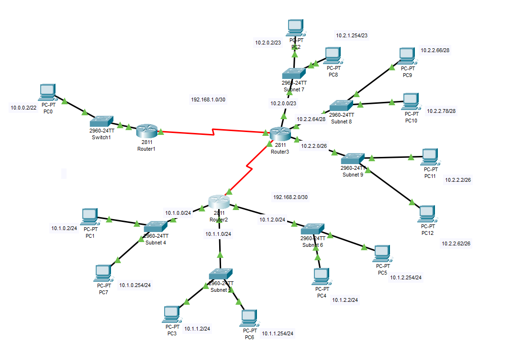

# Zadanie 2

Projekt sieci spełnił oczekiwania, organizacja po uwzględnieniu nowych wymogów chce podzielić dotychczasowe sieci na kilka podsieci.

1. Zaprojektuj oraz udokumentuj prototyp rozwiązania z wykorzystaniem oprogramowania ``CISCO Packet Tracer``, ``VirtualBox`` lub podobnego. 

## Schemat


## Charakterystyka
  * LAN 1 pozostaje bez zmian
  * LAN 2 zostaje podzielony na 3 równe podsieci
  * LAN 3 zostaje podzielony na 3 podsieci z uwzględnieniem
    * podsieć 1 ma obsłużyć do 512 hostów
    * podsieć 2 ma obsłużyć do 10 hostów
    * podsieć 3 ma obsłużyć do 32 hostów
  * Usunięty został również link pomiędzy Routerem (LAN 1) a Routerem (LAN 2)
  * Uwzględnij zmiany w tablicy routingów

## Zawartość

 * Adresy poszczególnych sieci IP
 * Adresację linków pomiędzy routerami
 * Tablice routingów na poszczególnych routerach
 
 
 

### Adresacja

| Sieć  | Adres Sieci | Host min     | Host max      | Adres rozgłoszeniowy |
| -------------     |:-------------: | -----:       | -----:        | -----:    |
| 1         | 10.0.0.0/22 | 10.0.0.1 | 10.0.3.254 | 10.0.3.255  |  

Podział na 3 równe podsieci, więc  

2^n >= 3 2^2 >= 3  
zatem n = 2  
Więc maska podsieci to /24  

| Podsieć  | Adres Podsieci | Host min     | Host max      | Adres rozgłoszeniowy |
| 4         | 10.1.0.0/24 | 10.1.0.1| 10.1.0.254 | 10.1.0.255 |  
| 5         | 10.1.1.0/24 | 10.1.1.1| 10.1.1.254 | 10.1.1.255 |  
| 6         | 10.1.2.0/24 | 10.1.2.1| 10.1.2.254 | 10.1.2.255 |  

Podział na 3 podsieci:  

| Podsieć  | Adres Podsieci | Host min     | Host max      | Adres rozgłoszeniowy |
| 7        | 10.2.0.0/23 | 10.2.0.1| 10.2.1.254 | 10.2.1.255 |  
| 8        | 10.2.2.64/28 | 	10.2.2.65 | 10.2.2.78 | 10.2.2.79 |
| 9        | 10.2.2.0/26 | 10.2.2.1  | 10.2.2.62 | 10.2.2.63 |


| Router | Interface | Ip | 
| ------------- | -------------  |:-------------:|
| Router 1 | Serial 0/3/1  |   192.168.3.2/30 | 
| Router 1 | FastEthernet 0/0  |  10.0.0.1/22 | 

| Router | Interface | Ip | 
| ------------- | -------------  |:-------------:|
|  Router 2 |  Serial 0/3/0  |  192.168.2.1 | 
|  Router 2 | FastEthernet 0/0  |  10.1.0.1/24 | 
|  Router 2 | FastEthernet 0/1  |  10.1.1.1/24 | 
|  Router 2 | FastEthernet 1/0  |  10.1.2.1/24 | 


| Router | Interface | Ip | 
| ------------- | -------------  |:-------------:|
|  Router 3 | Serial 0/3/0 |  192.168.3.1/30 | 
|  Router 3 | Serial 0/3/1  |  192.168.2.2/30 | 
|  Router 3 | FastEthernet 0/0  |  10.2.0.1/23 | 
|  Router 3 | FastEthernet 0/1  |  10.2.2.1/26 | 
|  Router 3 | FastEthernet 1/0  |  10.2.2.65/28 | 

## Konfiguracja w Cisco Packet Tracer

Routery Cisco 2811 zostały wyposażone w moduł WIC-2T, który pozwala na komunikację routerów przez port szeregowy  
Interfejsy WIC-2T zostały połączone ze sobą kablem Serial DCE, tak aby każdy router miał jeden interfejs aktywny (każdy interfejs z Serial 0 jest z ustalonym clockiem) oraz pasywny  
Każdy router jest wyposażony w 3 moduły FastEthernet, aby pozwolić na stworzenie 3 podsieci.
Każdy interface routera był konfigurowany za pomocą Cisco CLI, a dokładnie komendami:  

```> enable``` -- wejście w tryb uprzywilejowany  
```# config terminal``` -- wejście w tryb konfiguracji  
```(config)# interface <nazwa interfejsu> <numer interfejsu>``` -- konfiguracja interfejsu  
```(config-if)# ip address <ip <maska>``` -- nadanie adresu IP  
```(config-if)# clock rate 64000``` -- ustalenie częstotliwości zegara DCE (Tylko dla interfejsów serial z clockiem)  
```(config-if)# no shutdown``` -- włączenie interfejsu  
```# copy running-config startup-config``` -- ważna komenda zapisująca obecne ustawienia do ustawień ogólnych (Przez jej brak musiałem robić to zdanie dwa razy)

Podział na podsieci jest dostępny poprzez komendę  
``` ip add <adres urządzenia podsieci> <maska podsieci>```

## Routing

### Konfiguracja Routingu

Routing został skonfigurowany w Cisco CLI, na każdym routerze wykonano komendę  
```(config)# ip route <adres sieci> <maska sieci> <next hop>```  
Przykładowo, dla routingu pomiędzy sieciami 10.0.0.0 i 10.1.0.0 byłay to komendy  

### Router 1 
```(config)# ip route 10.2.0.0 255.255.254.0 192.168.3.1```    
### Router 2
```(config)# ip route 10.0.0.0 255.255.252.0 192.168.3.2```  

## Tablice routingu (Bezpośrednio z ```# show ip route```)  


### Router 1


C       10.0.0.0/22 is directly connected, FastEthernet0/0  
S       10.1.0.0/24 [1/0] via 192.168.3.1  
S       10.1.1.0/24 [1/0] via 192.168.3.1  
S       10.1.2.0/24 [1/0] via 192.168.3.1  
S       10.2.0.0/23 [1/0] via 192.168.3.1  
S       10.2.2.0/26 [1/0] via 192.168.3.1  
S       10.2.2.64/28 [1/0] via 192.168.3.1  
     192.168.3.0/30 is subnetted, 1 subnets  
C       192.168.3.0 is directly connected, Serial0/3/1  

### Router 2


S       10.0.0.0/22 [1/0] via 192.168.2.2  
C       10.1.0.0/24 is directly connected, FastEthernet0/0  
C       10.1.1.0/24 is directly connected, FastEthernet0/1  
C       10.1.2.0/24 is directly connected, FastEthernet1/0  
S       10.2.0.0/23 [1/0] via 192.168.2.2  
S       10.2.2.0/26 [1/0] via 192.168.2.2  
S       10.2.2.64/28 [1/0] via 192.168.2.2  
     192.168.2.0/30 is subnetted, 1 subnets  
C       192.168.2.0 is directly connected, Serial0/3/0  


### Router 3


S       10.0.0.0/22 [1/0] via 192.168.3.2
S       10.1.0.0/24 [1/0] via 192.168.2.1
S       10.1.1.0/24 [1/0] via 192.168.2.1
S       10.1.2.0/24 [1/0] via 192.168.2.1
C       10.2.0.0/23 is directly connected, FastEthernet0/0
C       10.2.2.0/26 is directly connected, FastEthernet0/1
C       10.2.2.64/28 is directly connected, FastEthernet1/0
     192.168.2.0/30 is subnetted, 1 subnets
C       192.168.2.0 is directly connected, Serial0/3/1
     192.168.3.0/30 is subnetted, 1 subnets
C       192.168.3.0 is directly connected, Serial0/3/0 

### Schemat sieci



