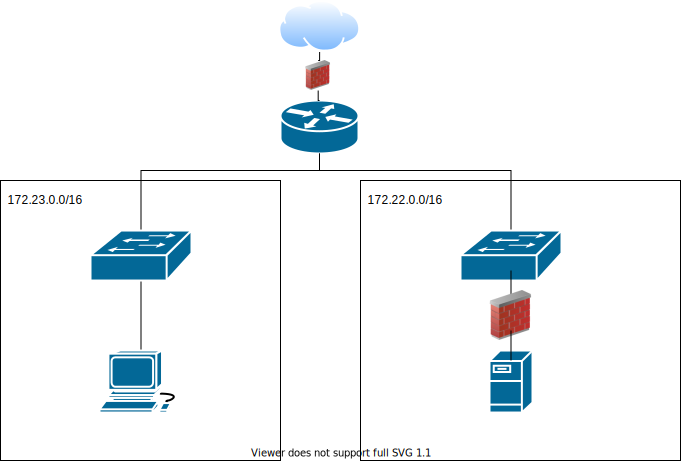

# firewall

  * https://access.redhat.com/documentation/en-us/red_hat_enterprise_linux/6/html/security_guide/sect-security_guide-iptables
  * https://linux.die.net/man/8/iptables
  * https://wiki.alpinelinux.org/wiki/Configure_Networking
  * http://www.linuxhomenetworking.com/wiki/index.php/Quick_HOWTO_:_Ch14_:_Linux_Firewalls_Using_iptables#.Xs9qQRMzZTY

## iptables

### tabele / tables (-t)

| tabela    |  przeznaczenie   | 
| ------------- |:-------------| 
|   ``nat``    |   NAT / przekierowania          |
|   ``filter``    |  filtrowanie                 |
|   ``mangle``    |  modyfikacje, (ex. TTL       |

### łańcuchy / chains iptab


| łańcuch    |  przeznaczenie   | 
| ------------- |:-------------| 
|   ``INPUT``    |       PAKIETY WCHODZĄCE                        |
|   ``OUTPUT``    |              PAKIETY WYCHODZĄCE               |
|   ``FORWARD``    |               PAKIETY PRZECHODZĄCE PRZEZ ŚCIEŻKĘ ROUTERA             |
|   ``PREROUTING``    |                       |
|   ``POSTROUTING``    |                         |

### co zrobić / target (-j)

|     |  przeznaczenie   | 
| ------------- |:-------------| 
|   ``ACCEPT``    |          Zaakceptować                     |
|   ``DROP``    |                   Ignorować           |
|   ``REJECT``    |                   Odrzucić i wysłać odpowiedź o odrzuceniu |
|   ``LOG``    |                Zapisz w logach             |


### Użycie

```bash
iptables -A -i <interface> -p <protocol (tcp/udp) -s <source> --dport <port> -j <target>
```

### wykorzystanie

* Lista obecnych reguł 
  * format tabeli
  * format listy
* Czyszczenie obecnych reguł aka flush
* Domyślne zachowanie ACCEPT / DROP
* Zezwolenie na połączenie dla konkretnego portu
* NAT
  * Przekierowanie portów ip:port -> ip2:port
  * Przekierowanie portów ip:port1 -> ip2:port2

### Zadanie 


1.
   * Przygotuj konfigurację sieci gdzie ``PC0`` pełni rolę bramy NAT
   * Przygotuj konfigurację sieci gdzie ``PC1`` udostępnia usługi




1. * Rozbuduj konfigurację sieci dla ``PC0`` o kolejny interfejs umożliwiający komunikację z siecią 2
  Zabezpiecz ``PC2`` konfigurując firewall z wykorzystanie ``iptables`` tak aby zezwolicz na połącznia przychodzące wykorzystujace 22 (SSH) włącznie z ``PC1``
   * Ustaw domyślne polityki dla INPUT, OUTPUT, FORWARD kolejno, DROP, ACCEPT, ACCEPT
   * Zapisz konfigurację firewall, tak aby została odtworzona po konownym uruchomieniu maszyny
   * Zweryfikuj możliwość połączenia wykorzystując program putty (klient SSH)

2. * Skonfiguruj ``NAT`` dla PC0
   * Zweryfikuj poprawność konfiguracji dla ``PC1`` pingując dowolny adres publiczny
   * Rozbuduj konfigurację interfejsów ``PC0`` o interfejs ``host-only``
   * Zainstaluj serwer http ``apache`` lub ``nginx`` dla ``PC2``
   * dokonaj przekierowania portów tak aby odwiedzając w przeglądarce adres w sieci ``host-only `` dla ``PC0``
     wyświetlona została strona startowa serwera zainstaloanego dla ``PC2`` 

3. * Zainstaluj program ``udp-echo-serwer`` dla ``PC2`` oraz ``udp-echo-client`` dla ``PC1``
   * skonfiguruj firewall dla ``PC2`` tak aby umożliwiał połączenia przychodzące wyłącznie dla następujacych portów
    * 80
    * 65433
   * zapewnij aby konfiguracja została załadowana po każdym uruchomieniu systemu
   * sprawdź konfigurację wykonując testowe polączenie na wskazanych wyżej portach
   * zweryfikuj brak możliwości ustanowienia połączenia na porcie 22 (SSH)
  
## Przypadki urzycia

| Przypadek | komenda | Komentarz |
| - | - | - |
| Blokowanie dostępu INPUT | iptables -I INPUT -j DROP | |
| Zezwolenie na dostęp konkretny port | iptables -A INPUT -j ACCEPT -p tcp --destination-port <NUMER PORTU> | |
| Zezwolenie na dostęp konkretny port + konkretny adres| iptables -A INPUT -j ACCEPT -i -p tcp --destination-port <NUMER PORTU> -s <ADRES IP> | |
| Przekierowanie portu | iptables -t nat -A PREROUTING -p tcp --dport <SOURCE PORT> -j REDIRECT --to-port <DESTINATION PORT> | |
| Reset ustawień firewall | iptables -F | |
| Zapis ustwień firewall | iptables-save > /etc/iptables/rules.v4 | |
